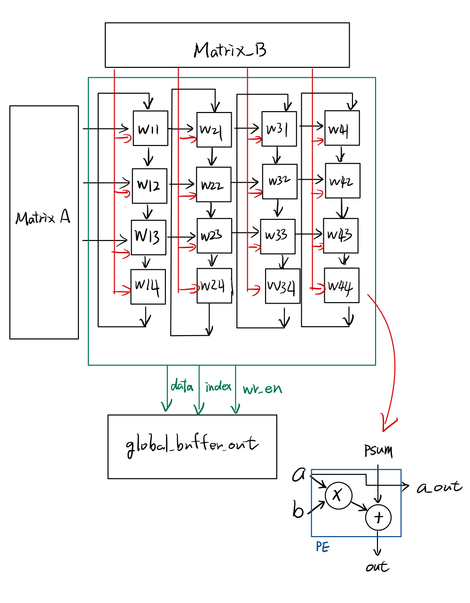
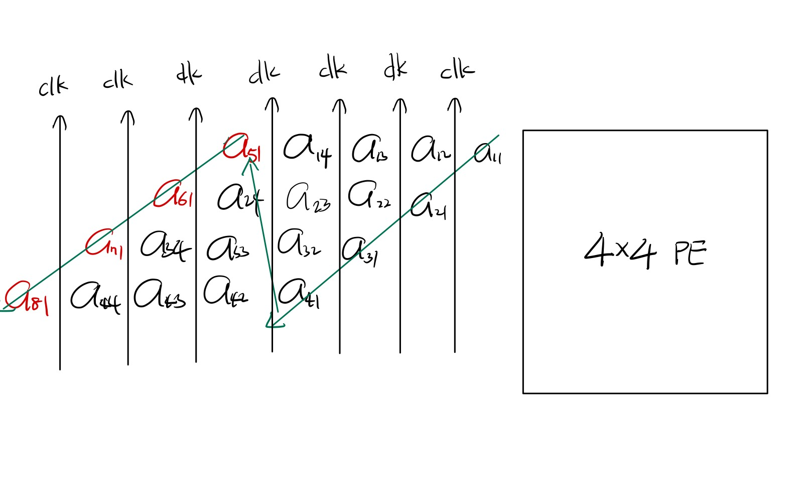
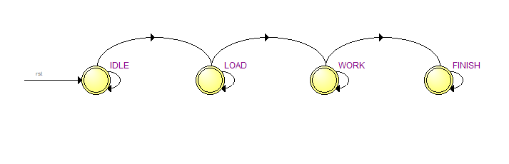
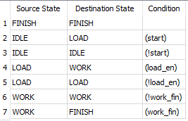
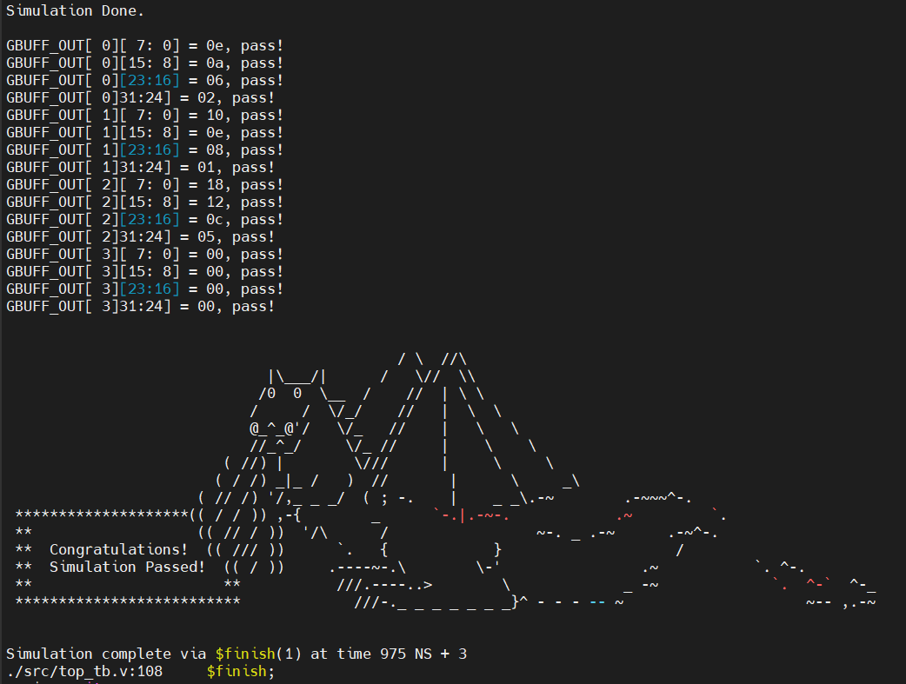
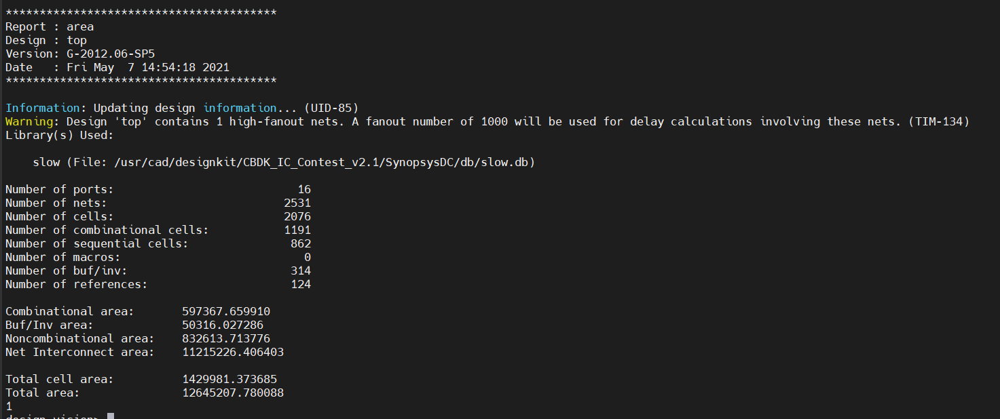
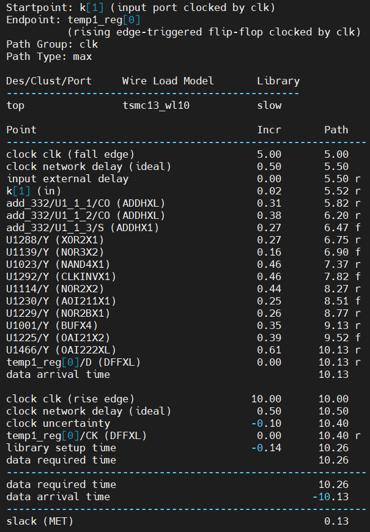
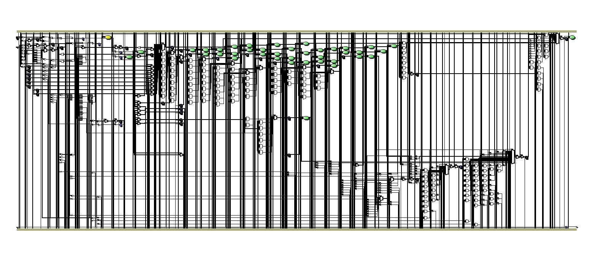
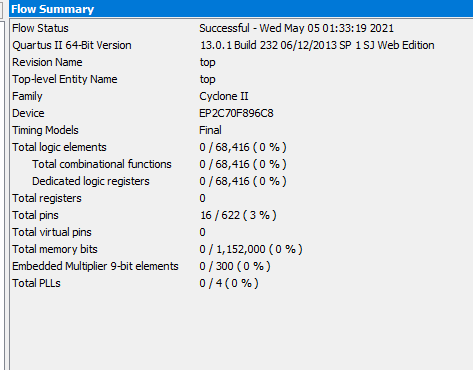

Student ID : H54061119 林哲宇

Architecture Graph
========
Matrix A 負責將從global buffer a 讀進來的值進行控制，將資料利用systolic array的方式丟進PE裡運算

總共設計4*4個pe，當矩陣的K大於4時，w14,w24,w34,w44會將答案寫入w11,w21,w31,w41的psum，進行循環，再判斷是要把哪一個pe輸出寫入

PE的設計則是另外設計一個module，然後top module要用時再進行呼叫，所以總共呼叫了16個PE，在電路上



Dataflow
========
At first, read all data into matrix_a[ ] and matrix_b[ ] from global buffer GBUFF_A GBUFF_B

```
          a11     a12     a13     a14
       --------------------------------
a[1]   | 31:24 | 23:16 | 15: 8 | 7: 0 |
       --------------------------------
```
第一個CLK

將a[0][31:24] 丟進計算單元w11裡

第二個CLK

將a[0][23:16] 丟進計算單元w11裡

將a[1][31:24] 丟進計算單元w12裡

第三個LK

將a[0][15: 8] 丟進計算單元w11裡

將a[1][23:16] 丟進計算單元w12裡

將a[2][31:24] 丟進計算單元w13裡

第四個CLK

將a[0][ 7: 0] 丟進計算單元w11裡

將a[1][15: 8] 丟進計算單元w12裡

將a[2][23:16] 丟進計算單元w13裡

將a[3][31:24] 丟進計算單元w14裡

第四個CLK

將a[1][ 7: 0] 丟進計算單元w12裡

將a[2][15: 8] 丟進計算單元w13裡

將a[3][23:16] 丟進計算單元w14裡

將a[4][31:24] 丟進計算單元w11裡,此時的weight 會改成 b[4][31:24]

以此類堆



上圖綠色箭頭回psum的順序，所以在電路作棟時，每一個pe都是在工作的，達到最快的運行時間

Finite State Machine
========
總共4個state: IDLE LOAD WORK FINISH

以及每個state的控制訊號

在WORK會同時進行pe運算及將答案寫入global buffer out




Simulation
========



模擬結果，利用測資3進行測試，運行時間為975ns

Synthesis
========
利用ncverilog進行合成

合成後 report area 及 report timing 結果

經過測試後發現，global buffer大概佔40萬，top使用了3個，共120萬，另外加pe及其他的element，共140萬




利用Quartus II 進行合成

Device: Cyclone EP2C70F896C8

合成後開啟RTL viewer 觀看合成結果



flow summary




